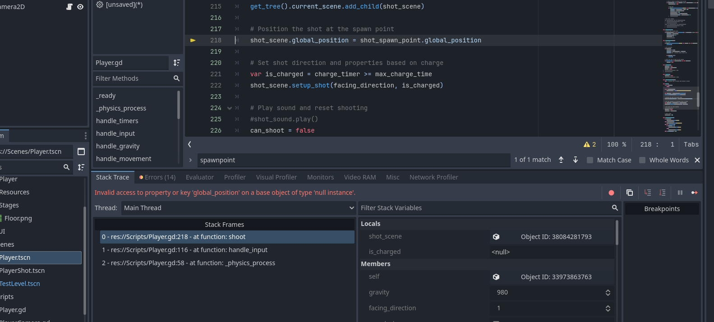

# Megaman X Engine Template

A complete Megaman X styled platformer engine template built in Godot 4.4. This template includes all the classic Megaman X movement mechanics and a fully functional player character.

## Features

### Player Mechanics
- **Smooth Movement**: Responsive left/right movement with acceleration and deceleration
- **Jumping**: Standard jump with coyote time and jump buffering for better feel
- **Wall Jumping**: Jump off walls with proper momentum
- **Wall Sliding**: Slide down walls with reduced fall speed
- **Dashing**: Air dash with cooldown system (resets on ground or wall)
- **Shooting**: Normal and charged shots with proper cooldowns
- **Particle Effects**: Visual feedback for dashing and wall sliding

### Technical Features
- **Physics Layers**: Proper collision layers for player, terrain, and projectiles
- **Camera System**: Smooth following camera with look-ahead
- **Animation System**: Full animation state machine (placeholder sprites included)
- **Audio System**: Sound effect system (placeholder audio included)
- **Input Mapping**: Complete control scheme setup

## Controls

| Action | Key | Alternative |
|--------|-----|-------------|
| Move Left | A | Left Arrow |
| Move Right | D | Right Arrow |
| Jump | W | Spacebar |
| Dash | C | Left Shift |
| Shoot | X | - |

## Project Structure

```
Scripts/
├── Player.gd              # Main player controller
├── PlayerShot.gd          # Projectile behavior
└── PlayerCamera.gd        # Camera follow system

Scenes/
├── Player.tscn            # Player character scene
├── PlayerShot.tscn        # Projectile scene
└── TestLevel.tscn         # Demo level for testing

needed_sprites.md          # List of required sprites
```

## Getting Started

1. **Open the project** in Godot 4.4 or later
2. **Run the project** - it will start with the TestLevel scene
3. **Test the mechanics** using the controls above
4. **Add your sprites** following the `needed_sprites.md` guide
5. **Build your levels** using the Player scene as a starting point

## Adding Sprites

Currently the template uses placeholder graphics. To add your own:

1. Check `needed_sprites.md` for the complete list of required sprites
2. Import your sprite images into the project
3. Open `Player.tscn` and select the `AnimatedSprite2D` node
4. In the Inspector, expand the `SpriteFrames` resource
5. Add your sprites to each animation (idle, run, jump, fall, dash, wall_slide)
6. Adjust frame timing and counts as needed

## Extending the Template

### Adding Enemies
- Create enemy scripts extending `CharacterBody2D` or `Area2D`
- Use collision layer 4 for enemies (already configured)
- Implement `take_damage(amount)` method for shoot interactions

### Adding Power-ups
- Create `Area2D` scenes with appropriate collision detection
- Connect to player's signal system or use area detection
- Extend player script with new abilities

### Level Design
- Use `StaticBody2D` for terrain (collision layer 2)
- Add bodies to "walls" and "terrain" groups for proper shot collision
- Consider one-way platforms using collision shapes

### Audio
- Replace `AudioStreamGenerator` with actual `.ogg` audio files
- Adjust volume and pitch as needed
- Add music system for background audio

## Physics Layers

The template uses the following collision layers:
- **Layer 1**: Player
- **Layer 2**: Terrain/Walls  
- **Layer 3**: Player Shots
- **Layer 4**: Enemies (for future use)

## Performance Notes

- Particle systems are optimized for 2D performance
- Shot objects automatically destroy themselves after 2 seconds
- Camera smoothing prevents jarring movements
- Physics calculations are frame-rate independent

## License

This template is provided as-is for learning and game development purposes. Feel free to modify and use in your own projects.

## Credits

Inspired by the classic Megaman X series mechanics and movement system.